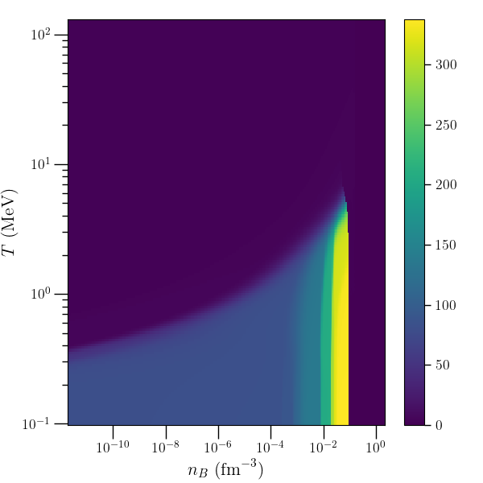
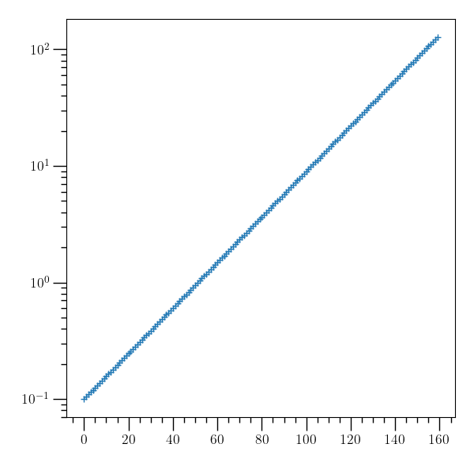

Plotting with o2graph
=====================

One can plot the EOS data with the O₂sclpy command ``o2graph``.
To begin, first download an EOS table::

  o2graph -download fid_3_5_22.o2 \
  https://isospin.roam.utk.edu/public_data/eos_tables/du21/fid_3_5_22.o2

Then, to summarize the objects in the file::

  o2graph -filelist fid_3_5_22.o2

Which gives output similar to::

  O2scl object "A" of type tensor_grid.
  O2scl object "A_max" of type tensor_grid.
  O2scl object "A_min" of type tensor_grid.
  ...
  Dataset "n_T" of type size_t with value 160.
  Dataset "n_Ye" of type size_t with value 70.
  Dataset "n_nB" of type size_t with value 301.
  Dataset "n_oth" of type size_t with value 11.
  ...

To create a two-dimensional density plot of a tensor_grid object,
for example::

  o2graph -download fid_3_5_22.o2 \
  https://isospin.roam.utk.edu/public_data/eos_tables/du21/fid_3_5_22.o2 \
  -read fid_3_5_22.o2 A -set logx 1 -set logy 1 -set colbar 1 \
  -to-table3d 0 2 slice 0.4 -den-plot slice pcm=True \
  -xtitle "$ n_B~(\mathrm{fm}^{-3}) $" -ytitle "$ T~(\mathrm{MeV}) $" \
  -save A_Ye04.png

plots the average nuclear mass number as a function of density and
temperature at a fixed electron fraction of 0.4:

The following::

   o2graph -read fid_3_5_22.o2 T_grid -set logy 1 -plot1 \
   marker=+ -save T_grid.png
   
plots the temperature grid:

         
